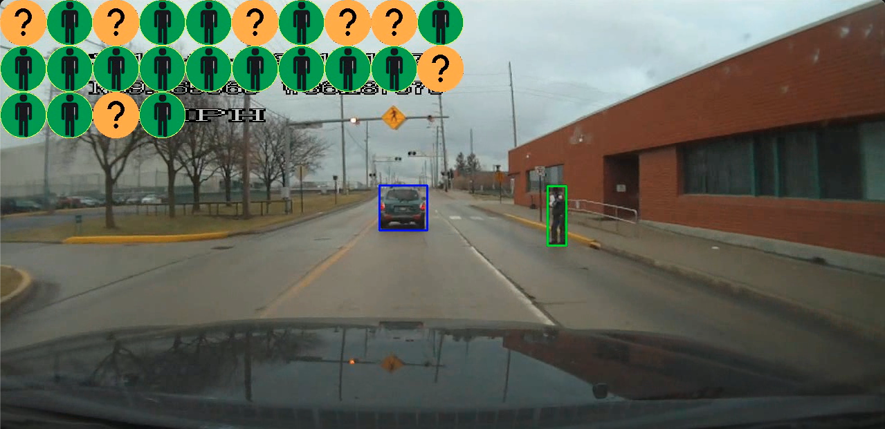
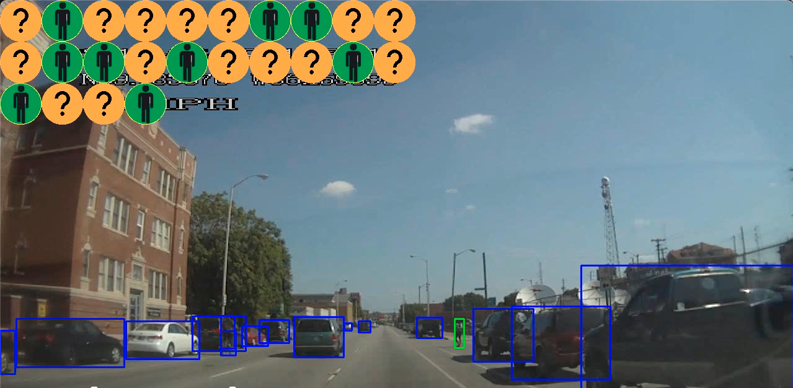

# Baseline of Pedestrian Intent Estimation on PSI dataset.




([**PSI2.0**](https://github.com/PSI-Intention2022/PSI-Dataset) is an extension dataset of [**PSI1.0**](http://situated-intent.net/) dataset.)

### :bookmark: News :
- 20230910: All PSI data including videos, CV annotations, and Cognitive Annotation (PSI1.0 & PSI 2.0) are public for download and future exploration! ~~[[Google Drive]()]~~ [[PSI Homepage](http://pedestriandataset.situated-intent.net)] :sparkler::zap:
- 20230606: The official [[Homepage](https://psi-intention2022.github.io)], [[GitHub](https://github.com/PSI-Intention2022/PSI-Competition)], and [[CodaLab]() ([Track 1](https://codalab.lisn.upsaclay.fr/competitions/13808#phases))([Track 2](https://codalab.lisn.upsaclay.fr/competitions/13812?secret_key=7a566b48-693d-47cf-9de8-d43e6b6fa512#phases))([Track 3](https://codalab.lisn.upsaclay.fr/competitions/13818?secret_key=bc6903e6-0a62-4df2-bb14-b31ae7b40a63#participate))] of the IEEE ITSS Student Competition are public. 

---

## 1. PSI dataset Structure

Note: 

\* variable \* denotes variable, will be replaced by specific value. 

"key_name" is key in dictionary. 

### (1) Computer Vision Objects Annotations
classes = ['pedestrian', 'rider','car', 'bus', 'bicycle', 'semi-truck', 'motorcycle', 
           'traffic sign', 'traffic light', 'construction cone'] 

skeleton = ['right_shoulder', 'left_eye', 'right_hip', 'right_ear', 'right_eye', 'right_wrist', 'left_elbow', 
            'left_knee', 'left_ear', 'right_elbow', 'right_ankle', 'left_ankle', 'left_hip',
            'right_knee', 'nose', 'left_wrist', 'left_shoulder']

```python
db = {
	'video_name': *video_name*,
	'frames': {
		'frame_*frameId*': {
			'speed(km/hr)': str, # e.g., "72"
			'gps': [str, str], # [N/S, W/E] e.g., ["N39.602013","W86.159046"]
			'time': str, # 'hh:mm:ss', e.g., "16:57:20"
			'cv_annotation': {
				'*objType*_track_*trackId*': {
					'object_type': str, # e.g., 'car', 'pedestrian', etc.
					'track_id': str, # e.g, 'track_3'
					'bbox': [float, float, float, float], # [xtl, ytl, xbr, ybr]
					'observed_frames': [int, int, int, ...], # e.g., [153, 154, 155, ...]
				}
			}
		}
	}
}
```

### (2) Cognitive Pedestrian Cross Intent Annotations
```python
db = {
	'video_name': *video_name*,
	'pedestrians': {
		*pedestrianId*: {
			'observed_frames': [], # e.g., [123, 124, 125, ...]
			'cv_annotations': {
				'bboxes': [[float, float, float, float], ...] # e.g., [box1, box2, box3, ...]
			},
			'cognitive_annotations': {
				*annotatorId1*: {
						'intent': [str, str, ...], # [intent1, intent2, ...], ['not_sure', 'cross', 'not_cross']
						'description': [str, str, ...],
						'key_frame': [int, int, ...] # 0: not key frame, 1: key frame 
				},
				*annotatorId2*: {
						'intent': [str, str, ...], # 
						'description': [str, str, ...], 
						'key_frame': [int, int, ...]
				},
                ...
			}
		}
	}
}
```

#### (3). Missing or error in Data/Annotation 
***(a)***
Missing cv annotation: [video_0064, video_0103, video_0155, video_0162, video_0167, video_0173, video_0201]

***(b)***
Missing speed data:  video_0032, video_0055, video_0093


## 2. Intent Prediction Baseline
(0) Arguments and Experiments Settings

```buildoutcfg
# Experimental Setting
Input: Observed video sequence + target pedestrian bounding box sequence
Output: Intent Prediction (+ Explanation embeddings)
Observed sequence length: 15 frames (0.5s for 30 fps)
Prediction: 1 output - intent prediction
Overlap rate: 0.9 for traingin/validation, 1 for test 
              (To sample tracks with stride length = len(observed_sequence_length) * overlap rate
Video Splits: 
    ('./splits/PSI2.0_split.json')
        - Train: Video_0001 ~ Video_0110
        - Val: Video_0111 ~ Video_0146
        - Test: Video_0147 ~ Video_0204
    ('./splits/PSI1.0_split.json')
        - Train: Video_0001 ~ Video_0082
        - Val: Video_0083 ~ Video_0088
        - Test: Video_0089 ~ Video_0110
```

(1) Generate database
```buildoutcfg
./database/create_database(args)
```
Organize the data into format as:
```python

db = {
    - *video_name*: { # video name
        - *pedestrian_id*: { # target pedestrian name
            - 'frames': [0, 1, 2, ...], # list of frames that the target pedestrian appear
            - 'cv_annotations': {
                - 'track_id': *track_id*, # target pedestrian's track_id, obtained from raw annoation
                - 'bbox': [[xtl, ytl, xbr, ybr], [], [], ...], # list of bounding boxes of the target pedestrian appeared
            },
            - 'nlp_annotations': {
                - *annotator_id*: { # annotator's id/name
                    - 'intent': [], # list of crossing itnent at speific frame, extended from key-frame annotations 
                    - 'description': [], # list of explanation of the intent estimation for every frame from the current annotator_id
                    - 'key_frame': [] # if the specific frame is key-frame, directly annotated by the annotator. 0-NOT key-frame, 1-key-frame
                },
                ...
            }
        }
    }
}
```

**Pedestrian crossing intent ground-truth:**

PSI has three kinds of intent annotation ("cross", "not sure", "not cross") from multiple annotators 
(24 for PSI100 and at least 9 for PSI200) for each target pedestrian in each frame. There are different
strategies to utilize and benefit from all these annotations. Here in this baseline, we process the intent annotation
as a binary classification problem, "Crossing" or "Not Crossing" via major voting startegy. Specifically, if one annotator
label the target pedestrian as "cross/not sure/not cross", it will be counted as voting weight "1.0/0.5/0.0". After averaging
the votes of all annotators, denoted as 'avg_intent_vote', the ground-truth intent annotation is "Crossing" if $avg_intent_vote >= 0.5$, and
"Not Crossing" if $avg_intent_vote < 0.5$.

(2) training / validation / test split

Our splits are provided in ```./splits```. Specifically, for PSI100, all videos are splited into train/val/test as ratio 
$0.75:0.05:0.2$. For PSI200, we take the first 110 videos (same as all PSI100 data) as training set, video_0111 ~ video_0146
as validation, and the rest 50 videos are for test. 


(3) Run training
```shell
python main.py
```

(4) Evaluation Metrics
```buildoutcfg
Acc: overall accuracy
mAcc: class-wise mean accuracy
F1: F1 score
```
<!-- |Dataset|split|Acc|mAcc|F1 |
|:---|:---|:---|:---|:---|
|PSI2.0|val|65.12|56.49|54.01|
|PSI2.0|test|58.37|51.54|47.87|
|PSI1.0|val|69.26|50.90|50.86|
|PSI1.0|test|63.56|53.13|50.55| -->

(4). Environment
```buildoutcfg
Python 3.8
PyTorch 1.10.0 + Cuda 111
Tensorboard 2.10.1
```

(5) Notes

This baseline only take the bounding boxes sequence of the target pedestrian as input. However, PSI contains various
multi-modal annotations and information available for further exploration to contribute to the intent prediction. E.g.,
Video sequence, other road users bounding boxes, detailed text-based explanation annotations, etc.

### References 

[1] Tina Chen, Taotao Jing, Renran Tian, Yaobin Chen, Joshua Domeyer, Heishiro Toyoda, Rini Sherony, Zhengming Ding. "Psi: A pedestrian behavior dataset for socially intelligent autonomous car." arXiv preprint arXiv:2112.02604 (2021). 

[2] Chen, Tina, Renran Tian, and Zhengming Ding. "Visual reasoning using graph convolutional networks for predicting pedestrian crossing intention." In Proceedings of the IEEE/CVF International Conference on Computer Vision, pp. 3103-3109. 2021. 


### Contact 

Please feel free to send any questions or comments to [psi.intent.benchmark@gmail.com](psi.intent.benchmark@gmail.com)

